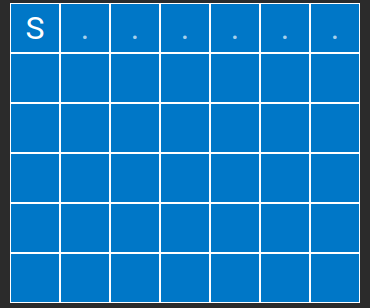
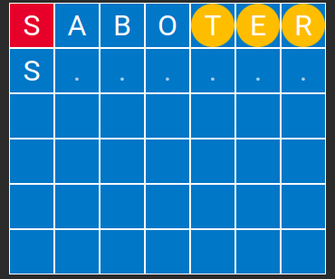
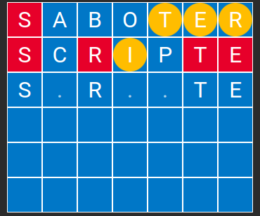
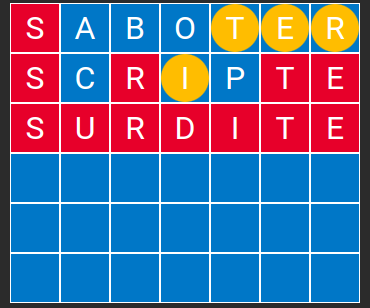

# SUTOM Solver
See the game at https://sutom.nocle.fr/#

# How to crack the SUTOM of the day
Let's say that the word of the day starts with "S" and contains 7 letters. The SUTOM game would show this grid:

In order to crack it, please call the following functions:

    # Read the dictionary pli07.txt
    words = read_file_dict()
    # Get the words starting with 'S' and containing 7 letters
    words = main.keep_words_with_length(words, 7)
    possible_words = get_possible_words(words, known_letters=[('S', 1)])
    # From this list, get the most probable word
    best_word = get_best_word_from_possibilities(possible_words)

Let's imagine that the solver outputs the word SABOTER. Please type it the game SUTOM. Let's imagine that the game gives this result:

The red letters are in the word to guess, at that place. The orange letters are in the word to guess, but at the wrong place. The blue ones are not in the word to guess. It means that you have to call the solver with the following parameters:

    # Read the dictionary pli07.txt
    words = read_file_dict()
    words = main.keep_words_with_length(words, 7)
    possible_words = get_possible_words(words, known_letters=[('S': 1)], wrong_place_letters=[('T', 5), ('E', 6), ('R', 7)], forbidden_letters={'A', 'B', 'O'})
    # From this list, get the most probable word
    best_word = get_best_word_from_possibilities(possible_words)

Now, let's imagine that the solver outputs SCRIPTE. Again, you type that word in the game SUTOM. Let's imagine that the game outputs this result:

I presume that you see the idea: you have to call the solver with this new result. Just don't forget to put all the forbidden letters:

    words = read_file_dict()
    words = main.keep_words_with_length(words, 7)
    possible_words = get_possible_words(words, known_letters=[('S', 1), ('R', 3), ('T', 6), ('E', 7)], wrong_place_letters=[('I', 4)], forbidden_letters={'A', 'B', 'O', 'C', 'P'})
    best_word = get_best_word_from_possibilities(possible_words)

Now the solver outputs SURDITE, and you win:

# If you want to improve the solver

The quality of the solver relies on 2 things:
- The quality of the dictionary pli07.txt
- The quality of the best possible word found from a list of possibilities - so you need a function select_best_word(words) which outputs the bast candidate out of the list 'words'

Therefore, you can try to improve it - for the moment, it is very simple: the best candidate selector is the function preference_for_letters_TRE(words)
In order to evaluate the quality of that function, you can let the solver work alone and compete against other solvers.

In order to do so, you can call the function run_sutom(word_to_guess, candidate_selector) with your own custom candidate_selector function. It returns the number of attempts of the solver before finding your word.
For example:

        attempts = main.run_sutom('SURDITE')

Here, run_sutom uses the 'preference_for_letters_TRE' selector by default, and returns ['SABOTER', 'SCRIPTE', 'SURDITE']. It means that it found 'SURDITE' in 3 attempts.

        def first_word_in_list(words):
            return words[0]

        attempts = main.run_sutom('SURDITE', candidate_selector=first_word_in_list)

Returns ['SABAYON', 'SCELLER', 'SPIRITE', 'SURDITE']. As you could imagine, getting the first word of the list is less efficient than privileging the words with letters T, R and E.

This implementation contains a 2nd selector: statistically_optimal_word
This one gives the best possible on depth 1, but it is very expensive in terms of computation

        attempts = main.run_sutom('SURDITE', candidate_selector=main.statistically_optimal_word)

You can also call run_challenge on a list of words to guess, in order to evaluate your solver on several words. Example:

        nb_attempts = main.run_challenge(['SURDITE', 'SCRUPULE', 'ECOEURE'], candidate_selector=main.preference_for_letters_TRE)

Returns [3, 3, 3]: the solver found 'SURDITE' in 3 attemps, 'SCRUPULE' in 3 attempts, and 'ECOEURE' in 3 attempts.